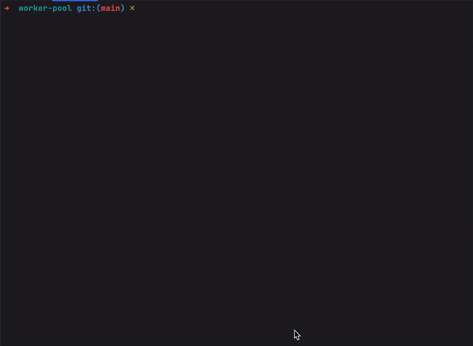

# Worker-pool

## Содержание
- [Задание](#задание)
- [Использование](#использование)
- [Реализация](#реализация)
- [Пример использования](#пример-использования)
- [Структуру проекта](#структура-проекта)

___
## Задание

Реализовать примитивный worker-pool с возможностью добавлять и удалять воркеры.
Входные данные (строки) поступают в канал, воркеры их обрабатывают (например, выводят на экран номер воркера и сами данные).
Задание на базовые знания каналов и горутин.

___
## Использование
1. Склонировать репозиторий: ```git clone https://github.com/Saljaev/worker-pool```
2. Прописать ```go build ./cmd/main.go```
3. Прописать ```./main -h``` для получения сведений об использование флагах
3. Запустить командой ```./main -count={int} -sep={string}```
___
## Реализация:
Написал worker-pool на чистом Go, из сторонних библиотек использовал лишь ```google/uuid```. Worker-pool содержит в себе 2 поля:
**limiter** - буферезированный канал, который и является количеством воркеров и **payload** - небуферезированный канал,
который используется для работы с входными данными. Динамическое изменение воркеров реализовано изменением размером канала **limit**.


Иммитация работы воркера - функция [do](./workers/worker.go), которая максимально изолирована от worker-pool и ничего не знает о его реализации.

В main создается главная горутина, которая работает в бесконечном цикле и вызывает новые горутины.
Единовременно может обслуживаться ```cap(limiter)``` задач.

Управление работой воркеров происходит с консоли, текст управления находится в файле [help.txt](./cmd/help.txt)
```
Для добавления воркера введите "/add {count}"
Для удаления воркера введите "/remove {count}"
Где count - количество воркеров для добавления/удаления

Для вывода текущего количества воркеров введите "/limit"
Для вызова вспомогательного меню введите "/help"

Для добавления работы введите "/addjob {data}",
Где data - работа для воркеров, введенная через разделитель
```


___
### Пример использования


___
### Структура проекта
```
cmd
└── backend
    ├── main.go <- Точка входа в приложение
    └── help.txt <- Вспомогательный файл с текстом
workers
├── pool.go <- Единичный воркер
└── worker.go <- Worker-pool
```
___

